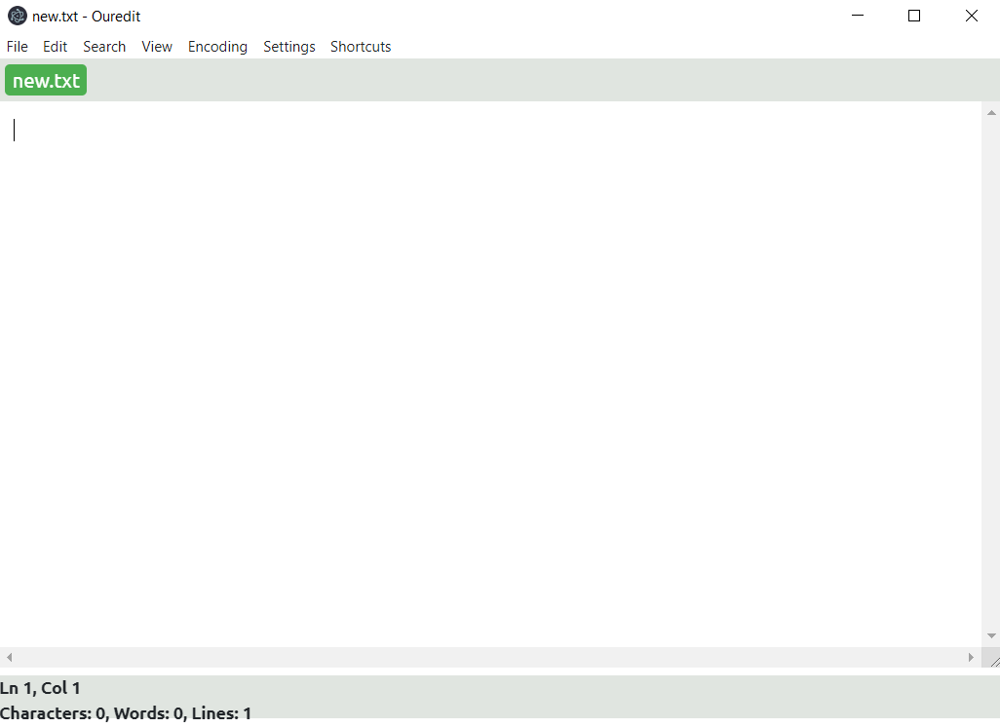
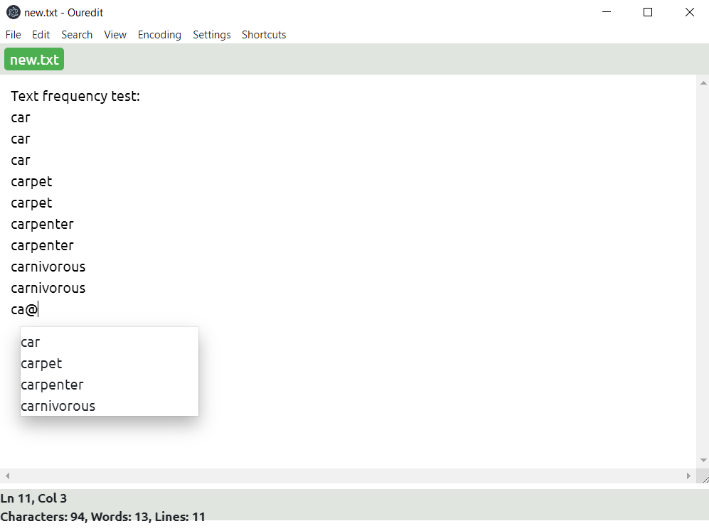

# Ouredit - Electron-based Text Editor

Ouredit is a portable text editor written in C# using an Electron wrapper. This means that the editor can interact with the user using native elements on all popular platforms.

## User manual

### Basic features

Upon opening, the user is greeted with a newly opened file. This file's name and path are set by default to 'new.txt' in the current directory, i.e. the directory in which Ouredit was launched.

The title as well as the file tab ribbon tells the user which files is being edited. In the lower left corner is the text statistics information. This information is updated while interacting with the editor.

The user may now type and edit the file content. Every change is automatically saved to the file. The updated content can be viewed using different tools right after the user has completed his latest change in the file content.

Optionally, the user can save the file content to a different file. This can be achieved using the 'File' menu, which contains among others a 'Save As...' option. A new file will be created or an existing one will be overwritten by the current file's text content.

The 'File' menu also features options to create, open or close a file tab. Note that at least one file tab must be opened in the editor.

### Advanced features

The user can take advantage of some more advanced features implemented into Ouredit. One of those features is the 'Undo', 'Redo' feature. Text inserts or commands can be undone using key shortcuts or launching the command directly from the 'Edit' menu. Note that text inserts and deletes work only when launched using a shortcut.

Ouredit allows the user to see his most frequently used words. The user can take advantage of this in order to get a text suggestion. By typing '@', a context menu is show. A list of up to four words is present inside the context menu, sorted by their frequency.

The encoding in which the opened file is interpreted can be changed using the 'Encoding' menu. Using the 'Interpret File as...' menu items changes the input encoding, i.e the encoding in which the file is read, while using the regular 'Encoding' menu items changes the output encoding, i.e. the encoding in which the file is saved. Note that with an aggressive auto saving mode the input and output encoding should not differ.

The user can use a variety of shortcuts. These can also be configured and saved using the 'Shortcuts' menu item. Invoking a shortcut requires pressing down keys specified in the shortcut and releasing them at once.

The settings window available in the 'Settings' menu is the central point of all Ouredit configuration. The user may see default values or change them to their preferences. Once saved, the configuration is saved to disc. Note that if the configuration file is not found during launch, the default configuration is loaded instead. Resetting the settings results in loading the default configuration.

## Program documentation

The application is split into two parts:

- Components Library
- TextEditor UI

### Components Library

The Library features a set of functions in a object oriented design that was designed with reusability in mind. The library is meant to be used with any UI and features a variety of functions to handle the input coming from the UI. As of now, **the library is completely separated from any UI** and does not depend on any other project.

The library was created using the MVC pattern. In this case, however, since no view is used, the view portion is skipped entirely. Models contain an application centric singleton - *ApplicationState*. Controllers feature mostly singleton classes that interact or are members of *ApplicationState*.

The text of the file is read using a *File* abstraction. Each *File* has a wrapper - *Buffer* - which can be of two types. Either immediate or lazy. The immediate buffer stores all of the file content into the memory and is therefore limited to file with the maximum file size of 20MB. The lazy buffer, not yet implemented, can read files of bigger sizes and only store a constant amount of text in the memory at once.

Using the *Buffer* abstraction, the UI can perform all kinds of editing tasks, while the *File* abstraction serves as a file IO handler.

The throughout documentation is present in the generated XML document.

### TextEditor UI

The chosen UI has been implemented using **Blazor** inside an **Electron.NET** wrapper for Electron application. Electron is a framework that allows hosted applications to run on any platform and use their native elements. This means that an Electron application can take advantage of portability and all other advantages that come with being a desktop app, rather than web app.

#### Electron.NET

The Electron.NET is a wrapper for invoking the Electron API itself. The API is usually accessed using TypeScript, however, since Electron.NET is a wrapper, it allows the programmer to invoke its functionality using C# code.

Electron.NET has been used to create the window, in which the application is hosted. The window has a set menu bar, which is native to the current platform. The window can be freely resized, minimized, or closed.  All code regarding Electron.NET can be found in the *Startup.cs* and *Menu.cs* files.

#### Blazor

In order to create a good user experience, a web app project was chosen. Inside the Electron.NET is a fully complete web application. It was firstly done via ASP.NET MVC, however, the ASP.NET functionality was not enough to create a smooth and dynamic UX.

Using Blazor brings the advantage of refreshing and dynamically changing pages and their components. All pages (Index and Settings) feature a set of components written using **Razor** (a mix of HTML and C#) that hold temporary data and render it on command. All pages and their components can be found in the *Components, Pages,* and *Shared* folders.

Rendering has to be trigger in one way or another. Triggering is done via events. Upon setting a value to an important variable, a notification event is fired. It's subscriber is set to a singleton service dedicated to handling that type of an event. The service optionally gathers data and sends it as arguments and redirects the event to the final subscriber. Final subscribers are mostly Razor components, however, the *MenuActions.cs* features two subscribers for changes coming from the UI as well. All files regarding events and their handling can be found in *Startup.cs, MenuActions.cs Index.razor*, the *Components* folder, and the *Services* folder.

